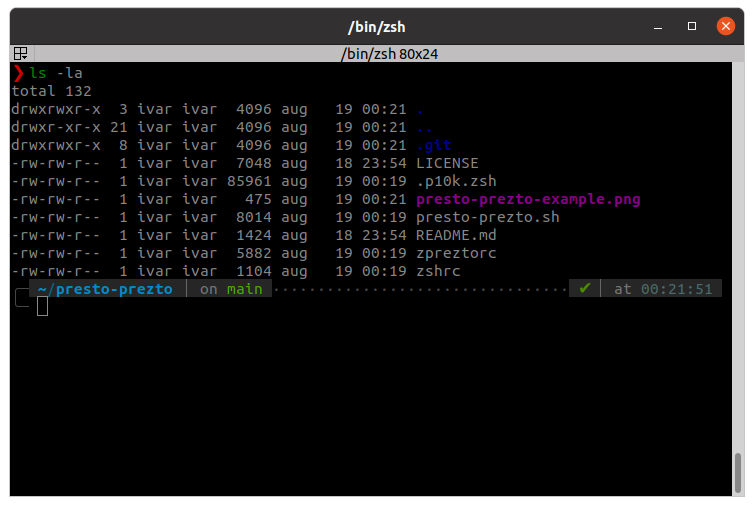

# presto-prezto

> Inspired by and based on [gh-zsh](https://github.com/gustavohellwig/gh-zsh) repository

A simple one-shot script to setup an awesome shell environment for Ubuntu and MacOS, with:
* [Prezto](https://github.com/sorin-ionescu/prezto) - Zsh framework with several nice built-in plugins
* [junegunn/fzf](https://github.com/junegunn/fzf) - fuzzy search for command line
* [clvv/fasd](https://github.com/clvv/fasd) - allows to run commands from history without fully typing them
* [Peltoche/lsd](https://github.com/Peltoche/lsd) (LSDeluxe) - enables more informative, colored `ls` output
* [yuhonas/zsh-aliases-lsd](https://github.com/yuhonas/zsh-aliases-lsd) - adds `ls` aliases to work with LSDeluxe
* [powerlevel10k](https://github.com/romkatv/powerlevel10k) - an awesome shell theme

## Demo

After the installation is complete, the command prompt will look like this:

## Installation

``` bash
curl -fsSL https://raw.githubusercontent.com/JGroxz/presto-prezto/main/presto-prezto.sh | bash
```

## Notes
* If you are already using zsh, your zsh config will be backed up to .zshrc-backup-date.
* If the text/icons look broken, make sure your terminal is using one of the Nerd fonts.
* Tested on:
  * Ubuntu 20.04
  * MacOS 10.14, and 11.3
